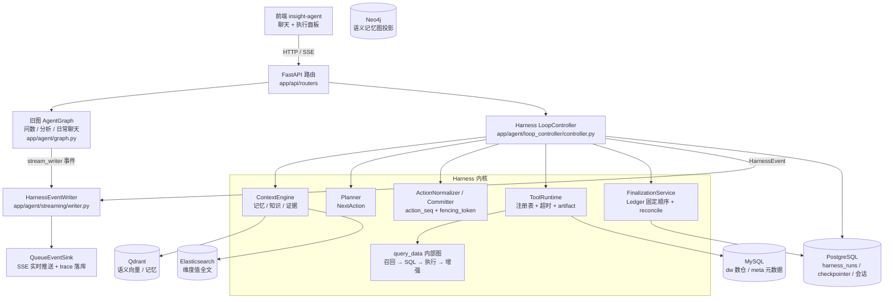
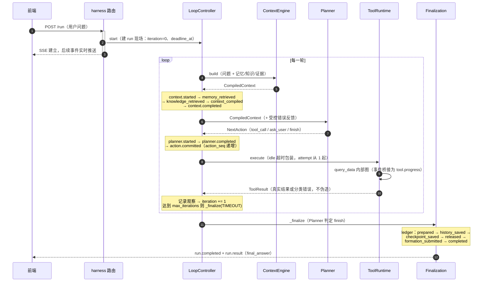

# Data Agent Harness 全量技术文档（as-built）

> **定位**：记录代码现状的实建文档。每个结论必须带 `file:line` 引用；与 SDD（`data_agent_harness_sdd.md` / `data_agent_harness_incremental_sdd.md`）不一致时以代码为准，并在当节标注「与 SDD 偏差：…」。
> **只写现状**：不写"将来会做"、"计划支持"。未实现的能力在疑点清单里登记。
> **分层原则**：节点出入口行为 → 本文档路径章节；节点内部细节（LLM 原始返回等）→ 后端日志；全量数据 → 执行面板「全部事件」tab。

## 阅读指引

- **新人 onboarding**：按第一部分 1 → 2 → 3 → 4 顺序读，读完即建立完整心智模型。
- **维护者**：直接查第二部分参考表与附录字段字典。
- **图**：三张图已按代码核对（2026-09-17，关键结论附 `file:line`）；后续代码变更需同步更新图与结论。

---

# 第一部分：三条执行路径

Harness 的一次 run 只有三种走向：**正常完成**、**确认暂停（可恢复）**、**异常终态（failed / timeout / cancelled）**。第 2 章是主干详版，第 3、4 章只写与主干的差异。

## 1. 总览

### 1.1 架构图（初稿，待校对）



### 1.2 正常路径时序图（已按代码核对）



### 1.3 HarnessStatus / LoopPhase 状态迁移图（已按代码核对）

```mermaid
stateDiagram-v2
    direction TB
    [*] --> RUNNING: run.started（iteration=0）

    state RUNNING {
        [*] --> BUILD_CONTEXT
        BUILD_CONTEXT --> PLAN: context.completed
        PLAN --> PLAN: planner.retrying（重试预算内）
        PLAN --> VALIDATE_ACTION: 产出动作
        PLAN --> COMPLETED: finish 动作（COMPLETED 唯一入口）
        VALIDATE_ACTION --> EXECUTE_TOOL: action.committed（tool_call）
        VALIDATE_ACTION --> PLAN: 校验失败 → 反馈重规划
        VALIDATE_ACTION --> WAITING_CONFIRMATION: ask_user（提交后暂停）
        EXECUTE_TOOL --> EXECUTE_TOOL: 幂等工具临时失败（attempt+1）
        EXECUTE_TOOL --> HANDLE_TOOL_RESULT: tool.completed / tool.failed
        HANDLE_TOOL_RESULT --> WAITING_CONFIRMATION: 工具返回 NEEDS_USER
        HANDLE_TOOL_RESULT --> RECORD_OBSERVATION: 非确认类结果
        RECORD_OBSERVATION --> BUILD_CONTEXT: iteration += 1<br/>（controller.py:510）
    }

    WAITING_CONFIRMATION --> BUILD_CONTEXT: confirmation.resolved<br/>（resume 后重建上下文重走一轮）

    RUNNING --> TIMEOUT: deadline_at 到期 / 达到 max_iterations
    RUNNING --> CANCELLED: 客户端断开（shield 保护收口）
    RUNNING --> FAILED: 未预期异常

    note right of WAITING_CONFIRMATION
        唯一非终态分支：不走 Finalization Ledger。
        两个进入点：planner ask_user（VALIDATE_ACTION 后）、
        工具返回 NEEDS_USER（HANDLE_TOOL_RESULT 后）。
        恢复不原地续跑：从 BUILD_CONTEXT 重走一轮。
    end note
    note bottom of COMPLETED
        四种终态统一经 _finalize 收口（phase=FINALIZATION）：
        Ledger 固定顺序 + active_run 释放
    end note
```

> **已核对（2026-09-17）**，原三个待校对点的结论：
> ① 恢复不是原地续跑：`resume()` 原子消费确认后经 `_run_guarded` 重入 `_run`，无条件回到 `BUILD_CONTEXT` 重建上下文再重新规划（controller.py:137-181、336-342）；用户答复已写入 state，Planner 输入可见。`confirmation.resolved` 事件的 phase 为 `RESTORE_RUN`（controller.py:159-165）。
> ② `max_iterations` 检查在 RECORD_OBSERVATION 阶段、`iteration += 1` 与保存现场之后（controller.py:510-519），达到即 `_finalize(TIMEOUT)`——终态是 **TIMEOUT** 而非 FAILED。
> ③ `COMPLETED` 只从 FINAL_ANSWER 处理分支进入（controller.py:423）；`_finalize` 默认 `terminal_status=COMPLETED`（controller.py:1013），其余全部调用点均显式指定 FAILED / CANCELLED / TIMEOUT。
>
> 另注：LoopPhase 还有三个在图中不占流程位置的值——`START_RUN`（start 入口事件，controller.py:126）、`RESTORE_RUN`（恢复 / 中断准备现场）、`FINALIZATION`（收口阶段）。

### 1.4 术语表

<!-- 逐条补充：run / turn / thread、iteration、NextAction、action、action_seq、attempt、fencing_token、ledger stage、CompiledContext、ToolResult、observation -->

| 术语 | 含义 | 定义位置 |
|---|---|---|
| | | |

## 2. 路径一：正常完成（主干详版）

> 本章是其余路径的基准。写法：事件序列为骨架，代码引用挂在对应事件上。

### 2.1 触发入口

<!-- 哪个 API、参数、run 现场如何初始化（iteration=0、deadline_at 计算、active_run 互斥） -->

### 2.2 事件序列

<!-- 按时间列事件；每个事件一行：事件名 → 发出位置 file:line → payload 关键字段 → 前端消费方式 -->

### 2.3 状态变化

<!-- HarnessStatus / LoopPhase 迁移 + harness state 关键字段变化（iteration、action_seq、tool_retry_counts…） -->

### 2.4 涉及模块

<!-- 每一步谁在干活，一段一句，详情引用第二部分章节号 -->

### 2.5 收口方式

<!-- _finalize 全流程：ledger 六个 stage 逐一说明（做了什么、失败会怎样） -->

### 2.6 前端表现

<!-- 执行面板：进度 tab / 步骤返回（按轮次分组）/ 全部事件；状态推导规则 -->

### 疑点清单

-

## 3. 路径二：确认暂停与恢复（差异版）

> 只写与第 2 章的差异。本质区别：暂停不是异常，是"还有下一次"的可恢复态。

### 3.1 与主干的分叉点

<!-- 两个分叉点：① Planner 产出 ask_user 动作（提交后暂停，controller.py:429-445）；② 工具返回 NEEDS_USER（观察记录前暂停，controller.py:487-506）。→ confirmation.required → LoopPausedResult，HTTP 响应结束但 run 存活。 -->

### 3.2 事件序列差异

<!-- confirmation.required payload / 用户提交确认 → confirmation.resolved -->

### 3.3 恢复的身份约束

<!-- 同一 run_id/turn_id/thread_id；resume 不能新建 thread 或覆盖旧现场（对应 todolist review 项 4） -->

### 3.4 收口方式

<!-- 不收口。恢复链路：resume() → _run_guarded → _run() 无条件回到 BUILD_CONTEXT（controller.py:336-342），重建上下文 + 重新规划；用户答复已消费写入 state，Planner 可见。确认幂等重放时仅补发 confirmation.resolved(status=idempotent)，不重启循环（controller.py:144-158）。 -->

### 3.5 前端表现

### 疑点清单

-

## 4. 路径三：异常终态（差异版）

> 三种异常全部经 `_run_guarded` 兜底进入 `_finalize`，不就地死掉；还没走完的分组在前端显示"中断"（partial）。

### 4.1 failed：意外失败

<!-- 未预期异常 → _prepare_interruption_state → _finalize(FAILED)；controller.py:232-246 -->

### 4.2 timeout：deadline / max_iterations

<!-- 三处来源：_check_deadline 循环边界（controller.py:281-285）+ _await_with_deadline 单调用包装（controller.py:287-303）+ max_iterations 达到（controller.py:510-519，收口为 TIMEOUT，final_answer="任务达到最大工具迭代次数…"）。前两者走 _prepare_interruption_state → _finalize(TIMEOUT)（controller.py:191-204）。 -->

### 4.3 cancelled：客户端断开

<!-- SSE 断连 → task.cancel → asyncio.shield 保护 _finalize(CANCELLED) 继续落库 -->

### 4.4 共同点与前端表现

<!-- Ledger 照常收口；last_error 写入现场；前端 partial 语义（statusForEvents interrupted 判定） -->

### 疑点清单

-

---

# 第二部分：模块总结（第二阶段）

> 每节固定模板：**职责一句话 → 输入 → 输出 → 关键决策（为什么这么设计）→ 相关文件 → 疑点**。协作关系已在第一部分讲过的，这里只写边界，不重复。

## 5. Harness 循环模块

### 5.1 ContextEngine
### 5.2 Planner
### 5.3 动作规范化与提交（action_seq / fencing_token）
### 5.4 ToolRuntime（注册表 / 重试语义 / artifact）
### 5.5 Finalization Ledger（固定顺序 / reconcile）

## 6. 事件系统

### 6.1 事件清单表

> 事件类型即状态机规范编码：`.started` / `.completed` / `.failed` / `.retrying` 配对 + run 级终态兜底；前端按类型推导展示状态，后端不冗余写 status 字段。

| 事件 | 发出位置 | 关键 payload | 前端消费 | 生命周期配对 |
|---|---|---|---|---|
| run.started | | | 「开始执行」完成态 | run.completed/failed/timeout/cancelled |
| context.started | | | 开始构建上下文（running→成功） | context.completed / context.failed |
| tool.progress | | custom_type + 内部图事件 | 工具进度（老图桥接） | — |
| confirmation.required | | confirmation_id / question | 等待用户确认（partial） | confirmation.resolved |
| run.result | | loop_result | 最终回答 | — |

<!-- 逐行补全全部事件类型；参考今日盘点：context.* 五连、planner.* 四连、action.committed、tool.started/progress/completed/failed、confirmation.*、run.* 六种 -->

### 6.2 SSE 与 trace 落库

<!-- format_sse 帧结构、心跳（sse_heartbeat_seconds）、save_execution_trace、历史回放 toHistoricalStreamEvent -->

### 6.3 前端消费规则

<!-- statusFromEventType / itemStatus 族内配对 / 按轮次分组（event.iteration）/ interrupted 判定 -->

## 7. 记忆系统

<!-- 三类记忆、形成管线（formation_submitted）、embedding 配置（dashscope text-embedding-v3 / 维度自检） -->

## 8. 前端执行面板

## 9. 配置清单

<!-- config.yaml 每一项：含义 + 消费方 file:line。可用 grep 消费方后填入 -->

## 10. 测试地图

<!-- 哪个测试文件守护哪条链路；184 通过 + 两个 D8 遗留失败文件 -->

---

# 附录

## A. HarnessState 字段字典

| 字段 | 含义 | 谁写 | 谁读 |
|---|---|---|---|
| | | | |

## B. AgentState 字段字典（旧图）

| 字段 | 含义 | 谁写 | 谁读 |
|---|---|---|---|
| | | | |

## C. 疑点汇总

<!-- 全文各章疑点清单的汇总索引；登记后转入 todolist 跟踪 -->
