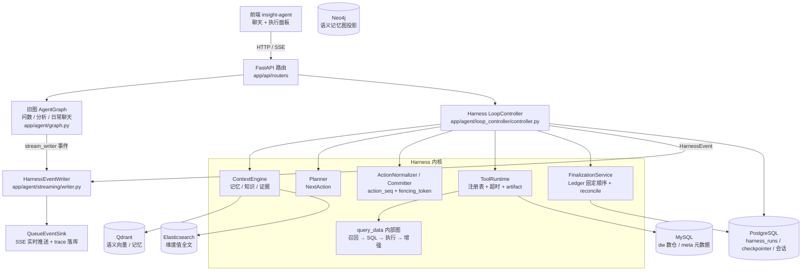
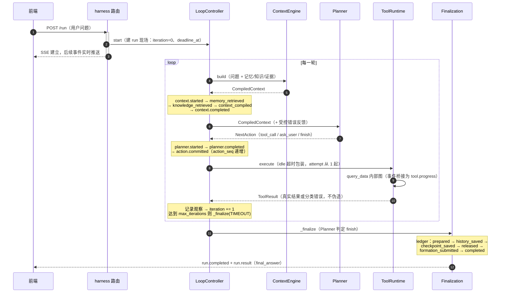

# Data Agent Harness 全量技术文档（as-built）

> **定位**：记录代码现状的实建文档。每个结论必须带 `file:line` 引用；与 SDD（`data_agent_harness_sdd.md` / `data_agent_harness_incremental_sdd.md`）不一致时以代码为准，并在当节标注「与 SDD 偏差：…」。
> **只写现状**：不写"将来会做"、"计划支持"。未实现的能力在疑点清单里登记。
> **分层原则**：节点出入口行为 → 本文档路径章节；节点内部细节（LLM 原始返回等）→ 后端日志；全量数据 → 执行面板「全部事件」tab。

## 阅读指引

- **新人 onboarding**：按第一部分 1 → 2 → 3 → 4 顺序读，读完即建立完整心智模型。
- **维护者**：直接查第二部分参考表与附录字段字典。
- **图**：三张图已按代码核对（2026-09-17，关键结论附 `file:line`）；后续代码变更需同步更新图与结论。

---

# 第一部分：三条执行路径

Harness 的一次 run 只有三种走向：**正常完成**、**确认暂停（可恢复）**、**异常终态（failed / timeout / cancelled）**。第 2 章是主干详版，第 3、4 章只写与主干的差异。

## 1. 总览

### 1.1 架构图（初稿，待校对）



### 1.2 正常路径时序图（已按代码核对）



### 1.3 HarnessStatus / LoopPhase 状态迁移图（已按代码核对）

```mermaid
stateDiagram-v2
    direction TB
    [*] --> RUNNING: run.started（iteration=0）

    state RUNNING {
        [*] --> BUILD_CONTEXT
        BUILD_CONTEXT --> PLAN: context.completed
        PLAN --> PLAN: planner.retrying（重试预算内）
        PLAN --> VALIDATE_ACTION: 产出动作
        PLAN --> COMPLETED: finish 动作（COMPLETED 唯一入口）
        VALIDATE_ACTION --> EXECUTE_TOOL: action.committed（tool_call）
        VALIDATE_ACTION --> PLAN: 校验失败 → 反馈重规划
        VALIDATE_ACTION --> WAITING_CONFIRMATION: ask_user（提交后暂停）
        EXECUTE_TOOL --> EXECUTE_TOOL: 幂等工具临时失败（attempt+1）
        EXECUTE_TOOL --> HANDLE_TOOL_RESULT: tool.completed / tool.failed
        HANDLE_TOOL_RESULT --> WAITING_CONFIRMATION: 工具返回 NEEDS_USER
        HANDLE_TOOL_RESULT --> RECORD_OBSERVATION: 非确认类结果
        RECORD_OBSERVATION --> BUILD_CONTEXT: iteration += 1<br/>（controller.py:510）
    }

    WAITING_CONFIRMATION --> BUILD_CONTEXT: confirmation.resolved<br/>（resume 后重建上下文重走一轮）

    RUNNING --> TIMEOUT: deadline_at 到期 / 达到 max_iterations
    RUNNING --> CANCELLED: 客户端断开（shield 保护收口）
    RUNNING --> FAILED: 未预期异常

    note right of WAITING_CONFIRMATION
        唯一非终态分支：不走 Finalization Ledger。
        两个进入点：planner ask_user（VALIDATE_ACTION 后）、
        工具返回 NEEDS_USER（HANDLE_TOOL_RESULT 后）。
        恢复不原地续跑：从 BUILD_CONTEXT 重走一轮。
    end note
    note bottom of COMPLETED
        四种终态统一经 _finalize 收口（phase=FINALIZATION）：
        Ledger 固定顺序 + active_run 释放
    end note
```

> **已核对（2026-09-17）**，原三个待校对点的结论：
> ① 恢复不是原地续跑：`resume()` 原子消费确认后经 `_run_guarded` 重入 `_run`，无条件回到 `BUILD_CONTEXT` 重建上下文再重新规划（controller.py:137-181、336-342）；用户答复已写入 state，Planner 输入可见。`confirmation.resolved` 事件的 phase 为 `RESTORE_RUN`（controller.py:159-165）。
> ② `max_iterations` 检查在 RECORD_OBSERVATION 阶段、`iteration += 1` 与保存现场之后（controller.py:510-519），达到即 `_finalize(TIMEOUT)`——终态是 **TIMEOUT** 而非 FAILED。
> ③ `COMPLETED` 只从 FINAL_ANSWER 处理分支进入（controller.py:423）；`_finalize` 默认 `terminal_status=COMPLETED`（controller.py:1013），其余全部调用点均显式指定 FAILED / CANCELLED / TIMEOUT。
>
> 另注：LoopPhase 还有三个在图中不占流程位置的值——`START_RUN`（start 入口事件，controller.py:126）、`RESTORE_RUN`（恢复 / 中断准备现场）、`FINALIZATION`（收口阶段）。

### 1.4 术语表

<!-- 逐条补充：run / turn / thread、iteration、NextAction、action、action_seq、attempt、fencing_token、ledger stage、CompiledContext、ToolResult、observation -->

| 术语 | 含义 | 定义位置 |
|---|---|---|
| | | |

## 2. 路径一：正常完成（主干详版）

> 本章是其余路径的基准。写法：事件序列为骨架，代码引用挂在对应事件上。

### 2.1 触发入口

前端只走流式端点 `POST /harness/run/stream`（harness.py:652-653）；非流式 `POST /harness/run` 并存（harness.py:595-596）。路由前缀 `/harness`（harness.py:88）。

请求模型 `HarnessRunRequest`（harness.py:92-103）：`input_text`（1-20000 字）、`user_id`（默认 `settings.app.default_user_id`）、`conversation_id`（可空，为空则服务端生成 uuid4，harness.py:655）、`asset_ids`（≤32 个，去重，harness.py:656）。

run 现场初始化顺序（以 stream 为例）：

1. **运行时预检**：`_require_runtime()` 校验记忆运行时、PG session factory、LLM client（harness.py:124-135）；Meta/DW 工厂校验（harness.py:666-669）。
2. **身份生成**：`HarnessRunRef{user_id, conversation_id, thread_id=conversation_id, turn_id=uuid4, run_id=uuid4}`（harness.py:659-665；契约 state_result_store/contracts.py:80-85）。thread_id 复用 conversation_id——**会话与 thread 一一对应**。
3. **单跑互斥**：`ConversationRepository.start_turn` 以 `with_for_update()` 锁会话行，`active_run_id` 非空且 ≠ 本 run_id 时拒绝（conversation_repository.py:156-175，检查在 174-175；写入在 211；路由调用 harness.py:689-696）。
4. **控制器装配**：`_build_controller` 从 `settings.harness.*` 读 max_planner_retries / max_tool_retries / max_iterations / run_timeout_seconds（harness.py:317-320；配置定义 config.py:29-47）。
5. **SSE 装配**：`asyncio.Queue` → `QueueEventSink`（publish 同时留存事件列表供 trace 落库，writer.py:62-72）→ `HarnessEventWriter`（harness.py:671-673）；`_sse_response` 里 `run_operation()` 被包成后台 task（harness.py:545 `create_task`），HTTP 响应是 `body()` 迭代器：`queue.get()` 带 `sse_heartbeat_seconds` 超时，超时发注释行心跳 `": heartbeat"`（harness.py:551-556），done marker 结束（558-559），客户端断连则 cancel task 并 shield（561-569）。
6. **deadline 在控制器侧计算**：`_new_state` 写 `deadline_at = now + run_timeout_seconds`（controller.py:1087-1094），每个循环边界由 `_check_deadline` 执行（controller.py:281-285）。

### 2.2 事件序列

事件只出自两处：`LoopController._emit`（controller.py:1138-1163）与 `ToolRuntime` 直接 `writer.emit`。**iteration 全程实时读 `state["harness"]["iteration"]`**：首轮 0，观察记录后 +1（controller.py:510），故"第 N 轮"事件 iteration = N-1，前端轮次标签 = iteration + 1。

一轮完整事件（正常完成 = 下表 2-12 重复若干轮 + 首尾段）：

| # | 事件 | 发出位置 | phase | payload 关键字段 | 前端消费 |
|---|---|---|---|---|---|
| 1 | run.started | controller.py:123-128 | start_run | — | 「开始执行」节点 |
| 2 | context.started | controller.py:847-852 | build_context | — | 构建上下文开始 |
| 3 | context.memory_retrieved | controller.py:886-902 | build_context | selected_count, source_counts{semantic/episodic/perceptual} | 记忆召回计数 |
| 4 | context.knowledge_retrieved | controller.py:903-912 | build_context | selected_count, evidence_count | 知识召回计数 |
| 5 | context.context_compiled | controller.py:914-920 | build_context | `_context_snapshot` 快照：build_id / token_count / resolved_asset_ids / model_messages / sections / trace（controller.py:944-984） | 上下文详情 |
| 6 | context.completed | controller.py:921-926 | build_context | — | 构建上下文成功 |
| 7 | planner.started | controller.py:745-751 | plan | action_seq（=当前+1） | 任务划分开始 |
| 8 | planner.completed | controller.py:786-800 | plan | action_seq, action_type, tool_name | 任务划分完成 |
| 9 | action.committed | controller.py:826-841 | validate_action | action_seq, action_type, commit_status（+action_id） | 「提交动作」节点 |
| 10 | tool.started | tool_runtime/runtime.py:72-79 | execute_tool | tool_name, attempt | 执行工具开始 |
| 11 | tool.progress | writer.custom（writer.py:123-137） | bind 注入 | custom_type + 内部图事件 | 工具内部进度（source 形如 `query_data:filter_table`） |
| 12 | tool.completed / tool.failed | runtime.py:209-223（类型选择 204-208） | execute_tool | tool_name, status, duration_ms, result_ref, error_code, row_count | 执行工具终态 |
| 13 | run.completed | controller.py:1120-1136（经 1049 调用） | finalization | status, final_answer, final_output_type, final_output_ref, error_code（iteration 取 finalization.iteration） | 全局成功 |
| 14 | run.result | 路由层 harness.py:490-500 | finalization | {loop_result} | 最终回答气泡 |

正常路径内的两个可选事件（临时失败被重试吸收时出现，之后照常继续）：

- `planner.retrying`（controller.py:618-627）：payload {retry_count, error_code}；条件 `error.retryable` 且 `retry_count < max_planner_retries`（controller.py:612）。
- `tool.retrying`（controller.py:690-701）：payload {tool_name, attempt, error_code}；条件为幂等工具的可重试 TEMPORARY_ERROR 且在 max_tool_retries 预算内。

**归属澄清（as-built 事实）**：`context.*` 全部由 controller 的 `_build_context` 发出、`planner.*` 全部由 `_plan_action` 发出——ContextEngine 与 PlanningAgent 模块内部**零事件代码**。事件集中在编排层，模块保持纯净。

终态事件顺序固定：**ledger 六 stage 走完 → run.completed → run.result**。run.completed 只在终态持久化成功后发布（controller.py:1113 注释）；run.result 由路由层在整个 operation 返回后发出（harness.py:487-500）。

### 2.3 状态变化

`_run()` 的 transition 序列（全部 status=RUNNING）：BUILD_CONTEXT(336) → PLAN(343) → VALIDATE_ACTION(373) → EXECUTE_TOOL(451) → HANDLE_TOOL_RESULT(463) → RECORD_OBSERVATION(507) → 回 BUILD_CONTEXT(521) → PLAN(528)……

harness state 关键字段随轮变化：

- `iteration += 1`：RECORD_OBSERVATION 阶段（controller.py:510）
- `action_seq`：`_commit_action` 成功后写入 `action.action_seq`（controller.py:825）
- `planner_retry_count` 清零、`last_error` 清除：planner 成功发行动作后（controller.py:369-372）
- `observations` 追加 RunObservation（controller.py:482）
- `state_version` 每次 transition +1（state_result_store/state.py:182）

持久化点 `_save_running_state`（= `run_store.save` 包 deadline，controller.py:1059-1066）调用行号：339、346、376、454、466、511、524、531——**每个 phase 边界都落库一次**，这是超时/取消时 `_prepare_interruption_state` 能"从最后一个已持久化版本"收口的前提（controller.py:305-327）。

进入收口：`_finalize` 先 transition 到 `RUNNING/FINALIZATION` 并写 `terminal_intent="completed"`（controller.py:1018-1023，全系统唯一携带 terminal_intent 的 transition），`final_answer` 写入 state（1017）。

### 2.4 涉及模块

- **路由层**（harness.py）：身份生成、互斥、SSE 管道、trace 落库；不参与业务决策。
- **LoopController**：唯一编排者。上下文构建（`_build_context` controller.py:844-942）、规划（`_plan_action` 737-801）、提交（`_commit_action` 803-841）、执行（`_execute_tool`，调用点 455-462）全部在其控制流内。
- **ContextEngine**：纯计算——输入 ContextRequest，输出 CompiledContext；不发事件、不写状态。
- **PlanningAgent**：纯计算——输入 planner_input，输出 NextAction；不发事件。
- **ActionCommitter**：commit 双 guard——status ∈ {committed, idempotent}（controller.py:821）、action_seq 一致（823）；防重复提交与旧代次动作。
- **ToolRuntime**：注册表 + Pydantic 入参校验（runtime.py:52-66，校验失败不产 tool.started 直接错误结果）→ `writer.bind` 包执行（80-85，桥接事件继承 source/iteration/action_id）→ `asyncio.wait_for` 工具超时（86-88）→ `_publish_result` 统一发终态（197-263）。
- **FinalizationService**：见 §2.5。
- **前端 execution-panel**：见 §2.6。

### 2.5 收口方式

`_finalize`（controller.py:1006-1057）四步：transition + terminal_intent（1018-1023）→ `run_store.save`（1024）→ `finalization_service.finalize(FinalizationInput)`（1032-1048）→ `_emit_terminal`（1049）→ 返回 `LoopRunResult`（1050-1057）。非 COMPLETED 终态时 `last_error.message` 复制进 `FinalizationInput.error_message`（1039-1043）。

Ledger 固定六 stage（finalization_repository.py:28-35），由 `PostgresFinalizationService._drive` 顺序推进（service.py:85-144）；每 stage 先检查 `stage_rank(当前) < stage_rank(目标)`（service.py:224-227）再执行，`advance()` 只允许 +1（finalization_repository.py:127-130）：

| stage | 做什么 | 实现 | 失败后果 |
|---|---|---|---|
| prepared | 建账本行，SHA-256 digest 锁定收口内容 | finalization_repository.py:57-92；service.py:63-68 | IntegrityError 后 digest 不一致 → FinalizationDigestConflict（finalization_repository.py:80-92） |
| history_saved | `finish_turn` 写助手消息 + turn output；结构化产物按引用从 ArtifactStore 读，缺失回退 text | service.py:93-97、146-182 | RuntimeError → FinalizationFailure |
| checkpoint_saved | transition 到终态 status + `run_store.save`（真正的终态落库点） | service.py:98-108 | 同上；此后失败 run 已是终态 |
| released | `release_active_run` 释放会话互斥 | service.py:109-120；conversation_repository.py:330-361 | 会话不存在 → RuntimeError |
| formation_submitted | 仅 COMPLETED 且配置记忆服务时提交 TurnMemoryInput，formation_run_id 记入账本 | service.py:121-128、184-206 | 同上 |
| completed | 纯账本推进，attempts+1 | service.py:129-132；finalization_repository.py:136-137 | — |

任何 stage 异常 → `FinalizationFailure(run_ref, stage)`（service.py:133-134），账本停在最后一个成功 stage，run 停在 `running/finalization + terminal_intent`。控制器**故意不降级成 FAILED**（controller.py:228-231，降级会伪造用户从未见过的终态），API 映射 503（harness.py:375-377）。恢复手段：`POST /harness/run/reconcile`（harness.py:833-852）→ `reconcile()`（service.py:70-83）从账本锁定的 `input_payload` 重建 FinalizationInput、从当前 stage 继续推进，永不回到 Planner/工具。

终态不变量（HarnessStateSnapshot.validate_combination，state_result_store/contracts.py:285-316）：终态必须 phase=finalization、terminal_intent==status、pending_confirmation 为 None。

### 2.6 前端表现

execution-panel.tsx 三个 tab：

- **进度**：单节点状态板 + 「第 N 轮」指示（currentRound = 全事件最大 iteration + 1）。
- **步骤返回**：`buildRoundGroups` 按 `event.iteration` 分轮 → 轮内按步骤标签分组（STEP_ORDER：开始执行 / 构建上下文 / 任务划分 / 提交动作 / 执行工具 / 等待用户确认 / 运行结果）；单轮 run 不加轮包装；轮状态由 statusForEvents 顺序遍历、最后事件定状态。
- **全部事件**：全量平铺，`itemStatus` 族内配对——`.started` 事件在同族存在 sequence 更大的 `.completed/.failed/.resolved` 时显示成功。

状态推导链：类型后缀约定（statusFromEventType）→ 失败类型直接 failed → running 且族内已有更晚终态则 success。SSE 帧 `id/event/data`（writer.py:182-185）；历史回放走 `POST /conversations/execution-trace`（conversations.py:78-96），payload.events 就是 SSE 路径 finally 里 `save_execution_trace` 存的同一份列表（harness.py:526-542）。

### 疑点清单

- `harness_finalizations.last_error` 列与 `advance(last_error=...)` 参数存在（models/harness.py:268-269、finalization_repository.py:113），但 `_drive` 从不传值——疑似预留死字段，待确认。
- 非流式 `POST /harness/run` 与流式端点装配代码几乎重复，前端只用流式——非流式端点的存留价值待确认。

## 3. 路径二：确认暂停与恢复（差异版）

> 只写与第 2 章的差异。本质区别：暂停不是异常，是"还有下一次"的可恢复态。

### 3.1 与主干的分叉点

两个分叉点，汇入同一个暂停方法 `_pause_for_confirmation`（controller.py:534-599）：

1. **Planner 产出 ask_user 动作**：提交动作后暂停（controller.py:429-445）。重复确认保护先行：`_should_stop_for_repeated_confirmation` 命中则直接 FAILED 收口（407-418），不产生 committed-but-pending 的悬空动作。
2. **工具返回 NEEDS_USER**：观察记录前暂停（controller.py:487-506），同样先过重复确认保护（489-498）。

暂停动作（controller.py:542-599）：构造 ConfirmationRequest（confirmation_id = `{run_id}:confirmation:{action_seq}`，expires_at = now + 24h，543-552）→ SHA-256 digest（553-559）→ `pending_confirmation` 写入 state（560-562）→ transition 到 `WAITING_CONFIRMATION / WAIT_CONFIRMATION`（563-567）→ `pause_for_confirmation` 把等待现场与 PENDING 确认记录写进**同一个 PostgreSQL 事务**（568-580）→ 发 `confirmation.required`（581-593）→ 返回 `LoopPausedResult`（594-599）。

HTTP 响应在 LoopPausedResult 后正常结束；run 存活在数据库里，等确认接口唤醒。两个分叉点都在 `iteration += 1`（controller.py:510）之前，所以**暂停不打断轮次计数，恢复后同一 iteration 重走本轮**。

### 3.2 事件序列差异

相对主干只多两个事件：

- `confirmation.required`（controller.py:581-593，phase=wait_confirmation）：payload {confirmation_id, question, reason_code, required_fields, expires_at}。前端进入「等待用户确认」步骤（等待态）。
- `confirmation.resolved`（controller.py:159-165，phase=restore_run）：payload {status}。resume 被接受后补发，之后事件流照常按轮次推进。

用户提交确认：`POST /harness/run/resume`（非流式 harness.py:727-730）或 `/run/resume/stream`（769-772）；请求模型 `HarnessResumeRequest`（harness.py:106-114）：run_id、user_id、confirmation_id、answer（≤4000）、decision（confirm/reject）、resolved_conditions。

### 3.3 恢复的身份约束

- **身份从数据库重建，不接受客户端覆盖**：`load_by_id(run_id, user_id)` → `_run_ref_from_state`（harness.py:734-741；helper 325-341 重新校验 user_id/conversation_id/thread_id/turn_id/run_id）——同一 run_id/turn_id/thread_id 原样恢复。
- 控制器以 state 里的 asset_ids 重建（harness.py:750-758），不复用请求参数。
- `resolve_confirmation` 原子消费确认（controller.py:139-141）：同一 confirmation_id 二次提交走幂等分支，仅补发 `confirmation.resolved(status=idempotent)`，不重启循环（controller.py:144-158）。
- decision=reject → `_finalize(CANCELLED)`，final_answer="用户拒绝了本次确认，任务已停止。"（controller.py:173-180）——拒绝同样走 Ledger，是正式终态。

### 3.4 收口方式

暂停本身**不收口**：不走 Ledger、不发终态事件，现场以 `WAITING_CONFIRMATION` 落库。恢复链路：`resume()` → `_run_guarded` → `_run()` 无条件回到 BUILD_CONTEXT（controller.py:336-342），重建上下文再重新规划；用户答复已消费写入 state，Planner 输入可见；iteration 不增，轮次连续。

### 3.5 前端表现

- 「等待用户确认」是 STEP_ORDER 固定步骤，confirmation.required → confirmation.resolved 之间显示等待态（族内配对推导，见 §2.6）。
- 恢复后是**新的 SSE 连接**（/run/resume/stream）；先前事件经 `POST /conversations/execution-trace` 历史回放补齐（toHistoricalStreamEvent），iteration 连续所以轮次分组无缝衔接。

### 疑点清单

- confirmation 过期（expires_at = 24h）由谁清理/收口？当前未见显式过期处理逻辑，待确认。

## 4. 路径三：异常终态（差异版）

> 三种异常全部经 `_run_guarded` 兜底进入 `_finalize`，不就地死掉；还没走完的分组在前端显示"中断"（partial）。

### 4.1 failed：意外失败

失败来源分两层：

- **运行级未预期异常**：`_run_guarded` 兜底 `except Exception` → `_prepare_interruption_state` → `_finalize(FAILED)`（controller.py:232-246）。
- **循环内判定的失败**（不靠异常，主动收口）：
  - Planner 重试耗尽或不可重试（controller.py:354-366）
  - 相同工具请求此前已失败（request_hash 防重，controller.py:397-404）
  - 重复确认无法解决（ask_user：407-418；NEEDS_USER：489-498）
- 工具失败本身**不直接收口**：ToolResult 分类错误写入 `last_error`（controller.py:483-486），受控反馈给 Planner 重规划；只有规划层消化不了才走到上面两条。

### 4.2 timeout：deadline / max_iterations

三处来源：

- `_check_deadline` 循环边界（controller.py:281-285）
- `_await_with_deadline` 单个外部调用包装（287-303）——只把"确实触及运行 deadline"的 TimeoutError 转成 HarnessDeadlineExceeded，组件自身超时保持原语义（300-302）
- max_iterations 达到：RECORD_OBSERVATION 后检查（510-519），`_finalize(TIMEOUT)`，final_answer="任务达到最大工具迭代次数…"

前两者在 `_run_guarded` 捕获 HarnessDeadlineExceeded → `_prepare_interruption_state` → `_finalize(TIMEOUT)`（controller.py:191-204）。

### 4.3 cancelled：客户端断开

SSE `body()` 检测到断连 cancel task 并 shield（harness.py:561-569）→ 控制器 asyncio.CancelledError 分支：`_prepare_interruption_state` → 收口任务 `create_task(_finalize(CANCELLED))` + `asyncio.shield`（controller.py:205-227）——请求已无法返回结果时，收口任务由 done callback 兜底消费异常（248-254），保证落库完成。

### 4.4 共同点与前端表现

三条路径共用 `_prepare_interruption_state`（controller.py:305-327）：

- 从**最后已持久化版本**重载现场（313-319），内存态不参与收口
- 若现场停在 WAITING_CONFIRMATION，先翻回 RUNNING/RESTORE_RUN（320-325）再写中断错误
- `_set_interruption_error` 把 category/code/message 写进 `last_error`（256-267）

之后全部经 `_finalize` 走完 Ledger 六 stage——与正常完成唯一的差别是 terminal_status 不同，且 formation_submitted 只在 COMPLETED 提交（service.py:121-128）。终态事件由 `_emit_terminal` 按 status 映射 run.failed / run.timeout / run.cancelled（controller.py:1114-1119）。

前端 partial 语义：statusForEvents 检测到 run.cancelled / run.timeout / run.failed 即判 interrupted，未走完的分组显示「中断」，已完成项保留成功态。

例外：`FinalizationFailure` 不在异常收口之列——不降级成 FAILED、留给 reconcile（controller.py:228-231）；前端表现为 run 迟迟没有终态事件，直到 reconcile 完成才收到终态。

### 疑点清单

- 收口在 ledger prepared 之前就失败（账本行不存在）时，harness.py:412-420 清理路径的行为待实测——该段仅在账本行存在时拒绝伪造 FAILED。

---

# 第二部分：模块总结（第二阶段）

> 每节固定模板：**职责一句话 → 输入 → 输出 → 关键决策（为什么这么设计）→ 相关文件 → 疑点**。协作关系已在第一部分讲过的，这里只写边界，不重复。

## 5. Harness 循环模块

### 5.1 ContextEngine
### 5.2 Planner
### 5.3 动作规范化与提交（action_seq / fencing_token）
### 5.4 ToolRuntime（注册表 / 重试语义 / artifact）
### 5.5 Finalization Ledger（固定顺序 / reconcile）

## 6. 事件系统

### 6.1 事件清单表

> 事件类型即状态机规范编码：`.started` / `.completed` / `.failed` / `.retrying` 配对 + run 级终态兜底；前端按类型推导展示状态，后端不冗余写 status 字段。

| 事件 | 发出位置 | 关键 payload | 前端消费 | 生命周期配对 |
|---|---|---|---|---|
| run.started | | | 「开始执行」完成态 | run.completed/failed/timeout/cancelled |
| context.started | | | 开始构建上下文（running→成功） | context.completed / context.failed |
| tool.progress | | custom_type + 内部图事件 | 工具进度（老图桥接） | — |
| confirmation.required | | confirmation_id / question | 等待用户确认（partial） | confirmation.resolved |
| run.result | | loop_result | 最终回答 | — |

<!-- 逐行补全全部事件类型；参考今日盘点：context.* 五连、planner.* 四连、action.committed、tool.started/progress/completed/failed、confirmation.*、run.* 六种 -->

### 6.2 SSE 与 trace 落库

<!-- format_sse 帧结构、心跳（sse_heartbeat_seconds）、save_execution_trace、历史回放 toHistoricalStreamEvent -->

### 6.3 前端消费规则

<!-- statusFromEventType / itemStatus 族内配对 / 按轮次分组（event.iteration）/ interrupted 判定 -->

## 7. 记忆系统

<!-- 三类记忆、形成管线（formation_submitted）、embedding 配置（dashscope text-embedding-v3 / 维度自检） -->

## 8. 前端执行面板

## 9. 配置清单

<!-- config.yaml 每一项：含义 + 消费方 file:line。可用 grep 消费方后填入 -->

## 10. 测试地图

<!-- 哪个测试文件守护哪条链路；184 通过 + 两个 D8 遗留失败文件 -->

---

# 附录

## A. HarnessState 字段字典

| 字段 | 含义 | 谁写 | 谁读 |
|---|---|---|---|
| | | | |

## B. AgentState 字段字典（旧图）

| 字段 | 含义 | 谁写 | 谁读 |
|---|---|---|---|
| | | | |

## C. 疑点汇总

<!-- 全文各章疑点清单的汇总索引；登记后转入 todolist 跟踪 -->
