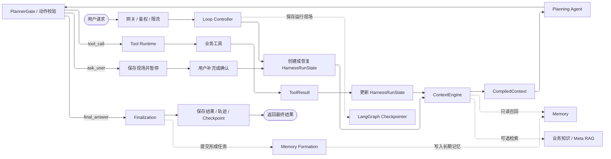

# Data Agent Harness 流程图导读

> 面向第一次阅读整体流程图的快速说明。
>
> 阅读顺序：先看主线，再看回环，最后看 Memory 和 Checkpointer 的辅助关系。本文只解释“谁在什么时候做什么”，不展开代码实现。

## 1. 一句话理解

```text
Loop Controller 负责调度，
ContextEngine 负责准备上下文，
Planning Agent 负责决定下一步动作，
Tool Runtime 负责执行工具。
工具结果回来后，重新准备上下文并继续循环，直到回答用户。
```

Data Agent Harness 不是一个单独的 Agent，而是一套组织 Agent、上下文、工具、记忆和状态的运行框架。

## 2. 整体流程图



图中：

- **实线**表示主执行流程。
- **虚线**表示读取、保存或异步提交等辅助关系。
- 从 `Update` 回到 `ContextEngine` 的线，是整张图最重要的循环。

## 3. 沿着主线阅读

### 3.1 用户请求 -> Loop Controller

用户提交一个问题，例如：

```text
给我看一下这个月的销售额为什么下降？
```

网关完成基础请求处理后，交给 `Loop Controller`。

`Loop Controller` 是 Harness 的调度中心，负责控制一次任务从开始到结束。它不负责具体分析，也不直接执行 SQL。

### 3.2 创建或恢复 HarnessRunState

Loop Controller 先创建，或者恢复当前任务的 `HarnessRunState`。它记录：

```text
当前问题和任务目标
当前计划与执行进度
已经调用过的工具及其结果
用户已经确认的条件
当前附件和结果引用
迭代次数、错误和超时状态
```

这一步保证任务能够暂停后继续，也保证下一轮规划能看到前面已经发生的事情。

### 3.3 ContextEngine -> CompiledContext

`ContextEngine` 根据最新的运行状态，准备本轮交给模型的信息。它会：

1. 读取近期会话和较早会话摘要。
2. 召回当前问题相关的长期记忆。
3. 解析“刚才”“上一次”“那张图片”等引用。
4. 在需要时读取附件内容或业务知识。
5. 去重、排序、摘要、压缩，并控制 token 预算。
6. 编译出 `CompiledContext`。

`CompiledContext` 可以理解为“模型这一轮允许看到的完整上下文”，而不是数据库中的全部数据。

### 3.4 Planning Agent -> PlannerGate

`Planning Agent` 读取 `CompiledContext`，只决定下一步动作，不直接执行操作。它可以输出三种动作：

```text
tool_call     调用业务工具
ask_user      请求用户补充或确认
final_answer  证据已经足够，生成最终回答
```

例如：

```text
tool_call: query_agent
arguments: 查询当前月份销售额及对比周期数据
```

`PlannerGate` 会先检查动作类型、工具、参数、权限和资源限制。通过后才允许执行。

### 3.5 Tool Runtime -> ToolResult

`Tool Runtime` 根据 `tool_name` 找到并执行具体工具，再返回统一的 `ToolResult`。

Data Agent 中的业务工具可以包括：

```text
Query Agent Tool       查询指标和明细数据
Data Analysis Tool     执行趋势、对比和异常分析
Report Tool            组织结论、表格和图表
Meta Retrieval Tool    检索指标、表、字段、维度和关系
Knowledge Tool         检索企业制度和业务口径
```

当前指标数值必须来自真实查询或分析工具。向量检索只负责帮助理解术语和定位候选，不能代替准确的当前数值。

## 4. 最重要的内部循环

当动作是 `tool_call` 时，主流程不是执行一次工具就结束，而是：

```text
ContextEngine
    ↓
Planning Agent
    ↓
PlannerGate
    ↓
Tool Runtime
    ↓
ToolResult
    ↓
更新 HarnessRunState
    └──────────────→ ContextEngine
```

工具结果写回状态后，必须重新构建上下文。这样下一轮 Planning Agent 才能知道：

- 查询结果是否已经足够。
- 是否还需要查询其他维度。
- 是否需要进行 Python 分析。
- 是否需要生成报告。
- 是否出现指标口径冲突。

所以，`Planning Agent` 负责“下一步做什么”，而 `Loop Controller` 负责让这个决定持续推动任务前进。

## 5. 两个特殊出口

### 5.1 `ask_user`：暂停等待确认

当指标口径冲突、时间范围缺失或任务条件不明确时，Planning Agent 不应该猜测，而是输出 `ask_user`。例如：

```text
当前发现两个“销售额”口径：
1. GMV：包含商品金额和运费。
2. 财务销售额：不包含运费，并考虑退款。

本次分析应使用哪一个口径？
```

Loop Controller 会保存现场、暂停运行并把问题返回给用户。用户确认后，恢复同一个 `HarnessRunState`，再重新经过 ContextEngine 和 Planning Agent。

用户本次选择只约束当前任务，不会自动修改全局指标定义。

### 5.2 `final_answer`：最终收尾

当 Planning Agent 判断证据已经足够，就输出 `final_answer`。

`Finalization` 负责保存最终回答、真实结果、报告、引用、执行轨迹和 Checkpoint，并提交本轮长期记忆形成任务，最后把结果返回前端。

## 6. Memory 和 Checkpointer 的位置

两者都负责保存，但保存的对象不同：

| 模块 | 保存对象 | 主要作用 |
| --- | --- | --- |
| `LangGraph Checkpointer` | 当前 `HarnessRunState`、线程消息和中间状态 | 让当前任务能够暂停、恢复和继续执行 |
| `Working Memory` | 当前会话中的短期消息 | 帮助理解多轮对话和历史引用 |
| `Episodic Memory` | 过去发生的任务、过程和结果 | 为相似任务提供历史经验 |
| `Semantic Memory` | 稳定事实、偏好、规则和业务关系 | 保持用户和业务口径一致 |
| `Perceptual Memory` | 附件身份和已提取内容 | 找回历史附件及其内容 |

记忆进入流程的方向是：

```text
读取：Memory ──> ContextEngine ──> Planning Agent

写入：Finalization ──> Memory Formation ──> 长期记忆
```

长期记忆以 PostgreSQL 为事实来源，Qdrant 用于向量召回，Neo4j 用于 Semantic Memory 的实体关系召回。

## 7. 用一个问题串起整张图

```text
用户：给我看一下这个月的销售额为什么下降？

1. Loop Controller 创建运行状态。
2. ContextEngine 准备历史、指标口径和相关记忆。
3. Planning Agent 提出调用 Query Agent Tool。
4. PlannerGate 检查动作和参数。
5. Tool Runtime 执行真实数据查询。
6. 结果写回 HarnessRunState。
7. ContextEngine 重新组织包含真实结果的上下文。
8. Planning Agent 决定继续查询、分析、请求确认，还是直接回答。
9. 必要时暂停等待用户确认，确认后恢复原任务。
10. 证据足够后输出 final_answer。
11. Finalization 保存结果并提交长期记忆形成。
```

## 8. 初次阅读只需要记住四点

1. `Loop Controller` 是整个 Harness 的调度中心。
2. `Planning Agent` 只提出下一步动作，不直接执行业务操作。
3. `ContextEngine` 在每次重要状态变化后重新构建上下文。
4. `Memory` 保存可复用信息，`Checkpointer` 保存当前任务现场。
