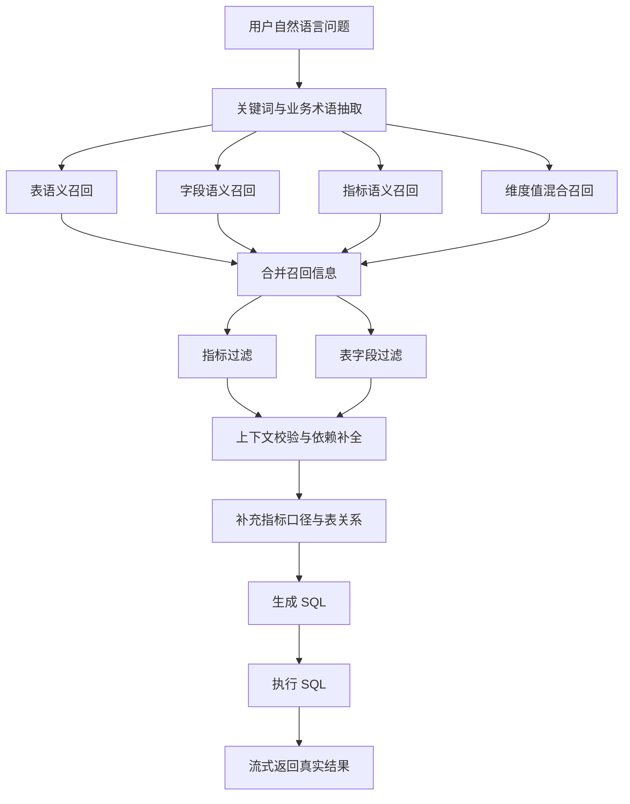
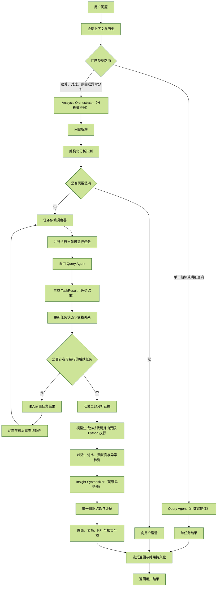

# 数据智能分析平台建设阶段成果与下一阶段规划

> 汇报人：________  
> 汇报日期：2026 年 8 月  
> 项目目标：建设面向企业管理者和业务人员的 AI 数据分析平台  
> 当前阶段：问数 Agent 核心闭环已完成，智能分析编排已完成原型验证，分析结果交付与生产化能力待建设

## 一、执行摘要

本项目的目标，是建设一套面向企业管理者和业务人员的 AI 数据分析平台，让用户能够通过自然语言直接获取经营数据、分析业务变化，并辅助日常决策。

本阶段优先完成了平台最基础也最关键的问数能力：用户可以使用日常业务语言提出问题，系统自动理解指标、维度、时间和筛选条件，定位可信的数据表与字段，生成 SQL 并返回真实查询结果。

这项工作的价值不只是增加一个自然语言查询入口，更重要的是搭建了数据智能应用所需的基础能力：

- 将数据仓库中的表、字段、指标、维度、维度值和表关系组织为可检索、可校验的语义元数据。
- 建立“语义召回、业务口径过滤、关系校验、SQL 生成、真实执行”的完整问数链路。
- 让业务问题优先使用已登记的指标口径和表关系，降低完全依赖大模型猜测数据库结构的风险。
- 形成可复用的 Query Agent（问数智能体），为后续趋势分析、对比分析、异常归因和报告生成提供查询底座。

当前问数 Agent 的核心闭环已经完成，并具备连接真实数据进行演示的能力；当前主要待补充的是标准问题验收、权限控制、安全约束和生产化运行保障。智能分析方面已完成问题路由、任务规划、依赖调度和“查询结果驱动 Python 计算”等关键环节的原型验证，但尚未完成最终结果汇总和面向用户的完整交付。因此，本报告将“AI 数据分析平台”作为整体建设目标，将问数 Agent 作为当前已交付阶段，将趋势分析、对比分析、异常归因和报告交付列为下一阶段建设内容，不把原型验证包装成已经完成的平台能力。

### 阶段结论

| 结论 | 当前状态 | 对平台建设的意义 |
| --- | --- | --- |
| 问数能力 | 核心闭环已完成，可连接真实数据运行 | 建立从自然语言问题到可信数据结果的基础入口 |
| 智能分析编排 | 已完成原型验证 | 已验证复杂问题可以拆解为多个任务，并根据前置结果驱动后续任务 |
| 分析结果交付 | 待建设 | 需要继续完成统一结论、证据组织、图表和报告等面向用户的交付能力 |
| 平台生产化 | 待建设 | 需要补充权限、审计、安全隔离、稳定性和量化评测 |

因此，本阶段的核心成果不是一个孤立的问数接口，而是完成了 AI 数据分析平台的数据语义底座、可信查询闭环和复杂分析编排基础。后续工作重点是把已经验证的分析链路沉淀为稳定、可交付的用户能力。

## 二、为什么要建设这个平台

企业并不缺少数据，真正的瓶颈是数据难以被企业管理者和业务人员及时、准确地使用。很多经营问题并不复杂，但从提出问题到获得可信结果，仍然需要经过较长的人工协作链路：

企业经营管理中的数据分析，通常需要经历以下过程：

```text
企业管理者或业务人员提出经营问题
    -> 数据人员理解业务口径
    -> 查找指标、表和字段
    -> 编写并修改 SQL
    -> 执行、核对并整理结果
    -> 形成分析结论
    -> 返回给企业管理者或业务人员
```

这种方式在需求量较少时可以依赖人工完成，但随着业务规模和数据使用频率增长，会逐渐暴露出几个问题：

1. 企业管理者和业务人员需要依赖数据或研发人员才能获得相对简单的经营数据。
2. 从业务问题到数据结果之间存在较长链路，影响问题响应速度和决策及时性。
3. 业务语言与数据库物理字段之间存在较高理解门槛，非技术人员难以独立完成分析。
4. 同一个“销售额”“订单量”可能因指标口径理解不同产生不一致结果。
5. 直接让大模型生成 SQL 容易出现表、字段、关联关系和指标口径猜测错误。
6. 传统问数通常只能回答“发生了什么”，还不能自然延伸到“变化趋势是什么”“为什么发生”和“应该关注什么”。
7. 数据查询、分析和决策之间缺少统一的智能入口，数据能力难以真正下沉到管理和业务一线。

因此，建设这个平台的核心原因，不是简单增加一个自然语言查数入口，也不是完全替代数据人员，而是把高频、明确、可验证的数据需求沉淀为平台能力，让企业管理者和业务人员可以更直接地使用数据，让数据团队将更多精力投入指标治理、复杂分析和决策支持。

平台需要分阶段实现三个目标：

1. **让数据更易用**：用户可以使用业务语言提出问题，降低数据库结构和 SQL 的使用门槛。
2. **让结果更可信**：通过指标口径、语义元数据、表关系和程序校验，减少查询结果因口径或结构理解错误产生偏差。
3. **让问数逐步升级为分析**：在可信查询的基础上，进一步支持趋势、对比、异常和原因分析，帮助用户从“获取数据”走向“理解变化和辅助决策”。

## 三、阶段价值

本项目的长期价值，是让数据分析从“少数人掌握的专业能力”逐步转变为“企业管理者和业务人员可以直接使用的组织能力”。当前阶段先交付可信问数底座，平台价值将随着分析和决策能力的建设逐步释放。

### 3.1 对企业管理者和业务人员的价值

- 让企业管理者和业务人员可以通过自然语言直接获取经营数据，降低使用数据的门槛。
- 缩短从提出经营问题到获得基础数据结果的路径，提高决策响应速度。
- 减少业务人员与数据人员之间反复确认表名、字段名和基础口径的沟通成本。
- 在后续分析能力完成后，进一步支持趋势、对比、异常和原因分析，而不只是返回一张数据表。
- 让数据分析从“提出需求、等待结果”逐步转向“直接提问、即时获取数据，并逐步开展多轮分析”。

### 3.2 对数据团队和组织的价值

- 将重复问数需求沉淀为可复用能力，而不是继续依赖人工逐条处理。
- 将指标口径、表关系和字段说明从个人经验转为系统资产。
- 为后续建设统一指标平台、数据目录和数据治理能力提供可复用元数据。
- 通过中间节点和事件日志，提高错误定位效率。
- 让数据团队从重复回答基础问题，逐步转向指标治理、复杂分析和业务决策支持。
- 将数据使用能力下沉到更多企业管理层和业务岗位，扩大数据资产的实际使用范围。

### 3.3 对平台和技术体系的价值

- 验证了大模型与企业数据仓库结合时“检索增强 + 结构化约束 + 真实执行”的实现路径。
- 形成了可复用的 Query Agent（问数智能体），后续分析能力不需要重新实现数据查询能力。
- 将模型擅长的语义理解与程序擅长的校验、执行分开，降低单纯依赖提示词的不确定性。
- 为后续接入更多主题域、指标和维度保留扩展边界。

## 四、阶段成果与平台建设链路

### 4.1 自然语言问数主链路

目前已经实现以下完整流程：



该流程不是把数据库结构整体丢给大模型，而是先通过语义检索缩小候选范围，再通过结构化元数据补全和校验上下文，最后才生成 SQL。

### 4.2 数据语义底座

围绕问数准确性，项目建设了以下元数据能力：

| 元数据类型 | 作用 |
| --- | --- |
| 表元数据 | 描述数据表的业务名称、粒度、别名和用途 |
| 字段元数据 | 建立物理字段与业务语言之间的映射 |
| 指标元数据 | 固化销售额、订单量等指标的计算表达式和聚合方式 |
| 维度元数据 | 描述可以按哪些业务视角拆分指标 |
| 维度值元数据 | 将用户表达映射到数据库真实筛选值 |
| 表关系元数据 | 约束事实表和维度表的连接方式 |
| 指标维度关系 | 校验某个指标是否适合按指定维度分析 |

这部分能力是项目的重要资产。它将隐含在开发人员经验里的数据库知识，转化为可维护、可检索、可复用的系统知识。

### 4.3 多路召回与结果校验

系统针对不同信息使用不同检索路径：

- 表、字段和指标通过向量语义检索匹配业务表达。
- 维度值结合精确检索和向量检索，提高别名、近义表达和真实值的匹配能力。
- 多路结果合并后，从 Meta 数据库补齐必要字段、指标、维度和表关系。
- SQL 生成前再次过滤候选，避免把所有召回结果无差别交给模型。
- 对指标依赖字段、表关系和指标维度兼容性进行程序校验。

相比“直接提示大模型生成 SQL”，这套链路增加了可解释性和工程约束，也为后续评测与问题定位留下了中间证据。

### 4.4 可运行的工程化后端

本阶段不只完成了算法验证，也完成了可运行的后端工程：

- 使用 FastAPI 提供普通接口和 SSE 流式接口。
- 使用 LangGraph 编排问数节点和并行召回流程。
- 使用 MySQL 保存数据仓库和结构化业务元数据。
- 使用 Qdrant 保存表、字段和指标等语义向量。
- 使用 Elasticsearch 与向量检索共同支持维度值匹配。
- 通过 Repository、Service、Entity 和 Agent Node 分层隔离数据库、业务和编排逻辑。
- 建立自动化测试，覆盖路由、计划、任务执行、动态 Python 计算和安全限制等关键行为。

### 4.5 项目主流程

下面展示项目从用户提出问题，到系统完成问数或智能分析，再到结果交付的整体主流程。它不是某一个业务问题的执行示例，而是平台的通用运行链路。图中同时展示平台目标形态和当前阶段边界：单一查询分支已基本完成；复杂分析中的路由、计划、依赖调度、动态条件传递和分析代码执行已完成原型验证；统一结果汇总、洞察总结和图表报告仍属于后续建设。



在这条主流程中，Query Agent 作为独立的数据查询能力被直接复用。单一查询由 Query Agent 直接完成；复杂分析则由 Analysis Orchestrator 负责问题拆解和任务调度，在每个具体任务需要数据时调用 Query Agent，任务完成后再继续处理依赖关系和后续分析。

当前完成度为：Query Agent 核心闭环已完成；问题路由、分析计划、依赖调度、动态条件传递和“模型生成分析代码、受限 Python 执行”的计算方式已完成原型验证；最终统一分析结果、Insight Synthesizer 以及图表报告产物仍属于后续建设能力。

这里的“报告”不是独立的问题类型，而是分析结果的交付形式。趋势、对比、原因和异常分析可以先经过同一套分析编排链路，再将最终结论、证据、表格和图表组织成面向用户的报告。

### 4.6 当前可演示能力

可使用真实数据演示如下类型的问题：

```text
查询 2018 年 8 月的销售额。

查询 2017 年每个月的销售额。

查询 2017 年 11 月和 12 月各商品类别的销售额。

查询 2017 年 11 月和 12 月各卖家地区的销售额。
```

复杂分析原型演示：

```text
找出 2017 年销售额下降最明显的月份，并分析该月份下降最多的商品类别和卖家地区。
```

针对上述问题，当前可以展示问题路由、分析计划、前置任务查询、依赖结果传递、后续任务查询，以及模型生成分析代码并由受限 Python 执行的过程；最终统一结论、洞察总结和图表报告仍属于后续建设能力。

演示时可以展示系统从关键词抽取、元数据召回、指标和字段选择，到 SQL 生成、执行和结果返回的全过程，而不只是展示最终答案。

| 阶段成果 | 当前可提供的验证证据 |
| --- | --- |
| 问数核心闭环 | 真实数据查询结果、生成的 SQL 和 SSE 流式执行过程 |
| 问题类型路由 | 单一查询与复杂分析进入不同执行分支的过程日志 |
| 分析编排原型 | 分析计划、任务依赖、前置结果传递和后续任务执行结果 |
| 动态分析计算 | 基于实际查询字段生成的 Python 代码及受限执行结果 |
| 工程质量保障 | 路由、计划、任务执行、Python 沙箱和安全限制相关自动化测试 |

## 五、个人承担的核心工作

本项目涉及数据建模、检索、Agent 编排、后端工程和大模型应用多个领域。本阶段主要完成工作包括：

1. 设计自然语言问数的整体技术链路和模块边界。
2. 建设维度模型数据仓库及 AI 可消费的语义元数据。
3. 设计表、字段、指标和维度值的召回与融合方式。
4. 实现指标、维度、字段和表关系的结构化校验。
5. 实现 Query Agent 的 LangGraph 编排、SQL 生成和真实执行。
6. 完成 FastAPI 接口、SSE 流式过程输出和服务层集成。
7. 建立自动化测试，并通过真实业务问题持续发现和修正链路问题。
8. 设计智能分析阶段的路由、计划、依赖任务和动态计算原型。

这项工作已经超出单一接口或单个模型调用的实现范围，承担的是从数据底座、核心链路到工程落地的端到端建设职责。

## 六、当前边界与风险

为了客观反映项目状态，当前仍存在以下边界：

| 项目 | 当前状态 |
| --- | --- |
| 单次问数链路 | 基本完成，可进行真实数据演示 |
| 指标和元数据覆盖 | 已覆盖当前实验数据，需要随业务主题持续维护 |
| 问数准确率评测 | 已有测试基础，仍需建设标准问题集和量化指标 |
| 权限控制与数据脱敏 | 尚未完成生产化设计 |
| SQL 风险控制 | 需要补充更完整的只读校验、超时和资源限制 |
| 智能分析 Agent | 已完成关键环节原型验证，最终汇总与稳定性尚未完成 |
| Python 动态计算隔离 | 当前为实验性子进程方案，生产环境需要容器级隔离 |
| 统一分析结果交付 | 尚未完成最终结论、证据、表格和图表的统一组织 |

明确这些边界不是降低项目价值，而是为了避免用演示效果代替生产标准，并为下一阶段投入提供清晰依据。

## 七、下一阶段规划

### P0：完成问数能力验收

- 建设覆盖核心指标、时间、维度和筛选条件的标准问题集。
- 统计字段召回准确率、指标选择准确率、SQL 执行成功率和结果正确率。
- 补充只读 SQL 校验、查询超时、结果行数限制和敏感字段控制。
- 选择一个真实业务主题进行小范围试点。

### P1：将智能分析原型沉淀为可交付闭环

这一阶段已经完成问题路由、分析计划、依赖调度、动态条件传递和分析代码执行的原型验证，下一步重点是补齐统一结果汇总、稳定性和面向用户的完整交付。

- **问题识别与分析计划**：识别问题是否需要多步查询、比较、归因或计算，并生成最少的分析任务。
- **依赖关系编排**：明确哪些任务必须等待前置任务，哪些任务可以在同一层并行执行。
- **前置结果回传**：将前置任务产生的目标对象、时间范围、对比基准等结构化结果传给下游任务。
- **动态查询生成**：下游任务根据真实的前置结果生成具体查询条件，而不是依赖预先写死的月份、地区或商品。
- **Query Agent 复用**：每个分析任务独立调用现有 Query Agent，重新召回当前任务需要的指标、维度和表关系。
- **分析代码执行**：由大模型根据实际查询结果的字段和数据画像生成分析代码，再交给受限 Python 运行环境执行并保留计算结果，避免让大模型直接凭语言推算数值。
- **分析结果汇总**：统一组织整体变化、下钻维度、计算结果和 SQL 证据。
- **结果可信交付**：将各任务的计算结果、SQL 证据和数据来源组织成统一分析结果，再生成面向企业管理者的文字、表格和图表结果。

### P2：面向用户交付

- 复用现有流式执行过程展示，补充统一的分析结论、SQL 证据、指标口径和数据来源展示。
- 支持分析结果中的表格、KPI 和基础图表展示。
- 增加会话上下文和追问能力。

### P3：生产化和规模化

- 接入用户身份、行列权限和审计日志。
- 建设查询缓存、并发控制、成本监控和降级策略。
- 扩展更多业务主题域和指标体系。
- 基于标准问题集建立持续评测、版本对比和发布基线。

## 八、建议的试点验收指标

在没有真实使用数据前，不建议直接承诺节省固定比例的人力。下一阶段可以用以下指标进行客观验收：

| 维度 | 建议指标 | 说明 |
| --- | --- | --- |
| 覆盖率 | 核心标准问题覆盖率 | 标准问题中系统能够理解并进入正确链路的比例 |
| 准确性 | 问数结果正确率 | 查询结果与人工验证结果一致的问题比例 |
| 稳定性 | SQL 执行成功率 | 生成 SQL 可以安全、正确执行的比例 |
| 效率 | 平均问题响应时间 | 从提问到获得查询结果的耗时 |
| 业务效果 | 自助完成率 | 无需数据人员介入即可完成的问题比例 |
| 分析能力 | 分析任务完成率 | 分析计划中的任务能够完成查询、计算并产出有效结果的比例 |
| 分析能力 | 分析结论正确率 | 分析结论与人工复核结果一致的比例，待统一分析结果能力完成后纳入验收 |
| 人效 | 单个问题人工处理时间变化 | 试点前后对同类问题进行对比 |

试点结束后，再以真实数据计算节省时间、减少重复需求和缩短决策周期等收益。

## 九、资源与决策建议

为了让项目从个人技术验证转为可持续业务能力，建议：

1. 确定一个数据口径较稳定、需求频繁的业务主题作为首个试点。
2. 指定业务或数据负责人共同确认标准问题、指标口径和验收结果。
3. 为权限、部署、模型调用和观测能力提供必要的基础设施支持。
4. 将该项目作为持续建设事项，而不是一次性演示任务。
5. 根据项目承担范围，对负责人的职责定位、技术影响力和回报进行同步评估。

## 十、结论

本阶段已经完成从自然语言问题到真实数据结果的问数 Agent 主链路，并沉淀了语义元数据、指标口径、表关系、多路检索、SQL 生成执行和流式服务等基础能力。

项目目前最重要的意义，是验证了一条可以继续落地的数据智能路径，并形成了后续智能分析能力可以直接复用的技术底座。下一阶段需要通过标准问题集、真实业务试点和生产化控制，将技术成果转换为可量化的业务收益。

基于目前已经承担的数据、AI 和后端端到端职责，以及后续可持续扩展的业务价值，建议将该项目负责人的职责范围和价值贡献纳入岗位与薪酬评估。
